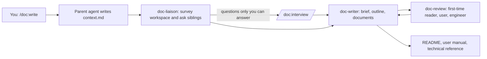

# document-agent

Part of the [VibeBB](https://github.com/VibeBB) agent family:
[bard-agent](https://github.com/VibeBB/bard-agent) ·
[electrical-circuit-agent](https://github.com/VibeBB/electrical-circuit-agent) ·
[mechanical-agent](https://github.com/VibeBB/mechanical-agent) ·
[wire-agent](https://github.com/VibeBB/wire-agent) ·
[UX-creator-agent](https://github.com/VibeBB/UX-creator-agent) ·
[document-agent](https://github.com/VibeBB/document-agent)

**English** | [日本語](#日本語)

<a id="english"></a>
## English

`document-agent` adds **doc**, a documentation writer, to OpenHands (Agent
Canvas). It writes your product's documentation into the workspace: a README
that a first-time user understands, a user manual, and a technical reference
for engineers. When it does not know something, it asks the sibling agent that
designed that part — and, when only you can answer, it interviews you.

> Target: OpenHands Software Agent SDK v1.49.6 / OpenHands Agent Canvas

### What it writes

| Document | For | Contents |
| --- | --- | --- |
| `README.md` | first-time visitors | what the product is, a diagram, who it is for, a 2..7-step quick start |
| `docs/user-manual.md` | people using the product | setup, how to use, care and safety, troubleshooting, specifications |
| `docs/technical-reference.md` | engineers | architecture diagram, interfaces, data and configuration, development |

Documents follow the conversation language (English or Japanese). Every
product claim comes from a sourced fact; anything nobody could confirm is
listed back to you as an open question instead of being guessed.

### How it works



- A `task` sub-agent does not receive the parent's conversation, so the parent
  summarizes it in `doc-work/<slug>/context.md`
  ([ADR-0001](docs/adr/ADR-0001-task-subagent-plugin.md)).
- `doc-liaison` reads sibling artifacts first (wiring contracts, enclosure
  envelopes, circuit briefs, UX stories) and asks the owning sibling
  (`wire-review`, `mech-review`, `circuit-review`, `ux-research`) one focused
  question when a fact is still missing
  ([ADR-0003](docs/adr/ADR-0003-sibling-inquiry-and-user-interview.md)).
- `doc-writer` records every claim as a fact with a source in
  `doc-brief.json`, then writes the documents. `doc_lint.py` (Python standard
  library only) checks the brief and each document: the README must explain
  the product with a diagram before the quick start, the manual must have
  usage and troubleshooting, and the technical reference must have an
  architecture diagram, interfaces, and development steps
  ([contract](docs/doc-brief-contract.md),
  [ADR-0002](docs/adr/ADR-0002-fact-grounded-doc-brief.md)).
- `doc-review` reads as a first-time visitor, a user, and an engineer and
  returns findings; it never edits the documents.
- The lint report `doc-lint.json` can only be written by the linter
  ([ADR-0004](docs/adr/ADR-0004-lint-report-protection.md)).

Quality documents (quality plans, test reports, risk assessments,
inspection records) are planned; their kinds are reserved in the contract
([ADR-0005](docs/adr/ADR-0005-quality-document-extension.md)).

### Installation via Agent Canvas WebGUI

1. Open **Customize** in the left sidebar and select the **Plugins** tab.
2. Click **Add plugin**, enter the following values, and click **Install**.

   | Field | Value |
   | --- | --- |
   | Source | `github:VibeBB/document-agent` |
   | Ref | the latest tag from [Releases](https://github.com/VibeBB/document-agent/releases), or `main` |
   | Path | `plugins/doc` |

3. Installation is complete when **doc** appears as enabled.
4. Optionally enable sub-agents (`enable_sub_agents`) so doc can split the
   work into liaison, writer, and reviewer and ask sibling agents. It also
   works without them (see the fallback in
   [docs/operations.md](docs/operations.md)).

For a non-GUI installation, place `plugins/doc` in the project directory
(`$OPENHANDS_PROJECT_DIR/plugins/doc`), point `DOC_PLUGIN_ROOT` at the plugin
directory, or use the SDK:

```python
PluginSource("github:VibeBB/document-agent", ref="main", repo_path="plugins/doc")
```

### Usage

1. Open a new chat on the workspace that contains your product.
2. Type `/doc:write` (or `/doc:write readme` for the README only).
3. If doc asks you about the product — why you made it, who it is for —
   answer in your own words, or say "skip".
4. Read the result: `README.md`, `docs/user-manual.md`,
   `docs/technical-reference.md`, plus the open questions it lists.

| Command | What it does |
| --- | --- |
| `/doc:write [all\|readme\|manual\|tech] [subject]` | Gather facts, interview when needed, write, lint, review |
| `/doc:interview [slug] [topic]` | Ask you up to five questions and record the answers verbatim |
| `/doc:doctor` | Check the plugin install and which sibling plugins are available |

Work files live in `doc-work/<slug>/` (`context.md`, `survey.md`,
`inquiries.md`, `interview.md`, `doc-brief.json`, `outline.md`, `review.md`,
`doc-lint.json`).

### Development

```bash
uv sync --group sdk-check
uv run ruff check . && uv run ruff format --check .
uv run pyright
uv run pytest -q
uv run python scripts/verify_docs.py
uv run --group sdk-check python scripts/check_plugin_load.py
```

See [CONTRIBUTING.md](CONTRIBUTING.md), [AGENTS.md](AGENTS.md), and the
documentation index in [docs/README.md](docs/README.md).

### License

BSD-3-Clause — see [LICENSE](LICENSE) and
[THIRD_PARTY_NOTICES.md](THIRD_PARTY_NOTICES.md).

<a id="日本語"></a>
## 日本語

`document-agent` は OpenHands（Agent Canvas）にドキュメント担当エージェント
**doc** を追加するプラグインです。製品のドキュメントをワークスペースに書きます。
初めての人にも分かる README、取扱説明書、エンジニア向けの技術資料の3つです。
分からないことは、その部分を設計した姉妹エージェントに聞きます。
あなたにしか答えられないこと（製品への想いなど）は、あなたにインタビューします。

> 対象: OpenHands Software Agent SDK v1.49.6 / OpenHands Agent Canvas

### 作るドキュメント

| ドキュメント | 読者 | 内容 |
| --- | --- | --- |
| `README.md` | 初めて見る人 | どんな製品か、図解、誰のためか、2〜7手順のクイックスタート |
| `docs/user-manual.md` | 使う人 | 準備、使い方、安全上の注意、トラブルシューティング、仕様 |
| `docs/technical-reference.md` | エンジニア | アーキテクチャ図、インターフェース、データと設定、開発手順 |

文書は会話の言語（日本語または英語）で書かれます。製品についての記述はすべて
出典付きの事実に基づきます。誰にも確認できなかったことは推測で書かず、
未解決の質問としてあなたに返します。

### 使い方

1. 製品のワークスペースで新しいチャットを開きます。
2. `/doc:write` と入力します（README だけなら `/doc:write readme`）。
3. 製品について質問されたら、自分の言葉で答えます（答えない場合は「スキップ」）。
4. `README.md`、`docs/user-manual.md`、`docs/technical-reference.md` と、
   一覧で返される未解決の質問を確認します。

| コマンド | 内容 |
| --- | --- |
| `/doc:write [all\|readme\|manual\|tech] [題材]` | 事実を集め、必要ならインタビューし、書いて、lint とレビューをします |
| `/doc:interview [slug] [話題]` | 最大5問を質問し、回答をそのまま記録します |
| `/doc:doctor` | プラグインの導入状態と、使える姉妹プラグインを確認します |

### インストール

Agent Canvas の **Customize** → **Plugins** → **Add plugin** で、Source に
`github:VibeBB/document-agent`、Ref に最新タグ（または `main`）、Path に
`plugins/doc` を入力して **Install** します。姉妹エージェントへの問い合わせを
使うには sub-agents（`enable_sub_agents`）を有効にします。無効でも動作します。

品質文書（品質計画書、試験成績書、リスクアセスメント、検査記録）の作成は
今後対応予定で、契約上の種別は予約済みです。
