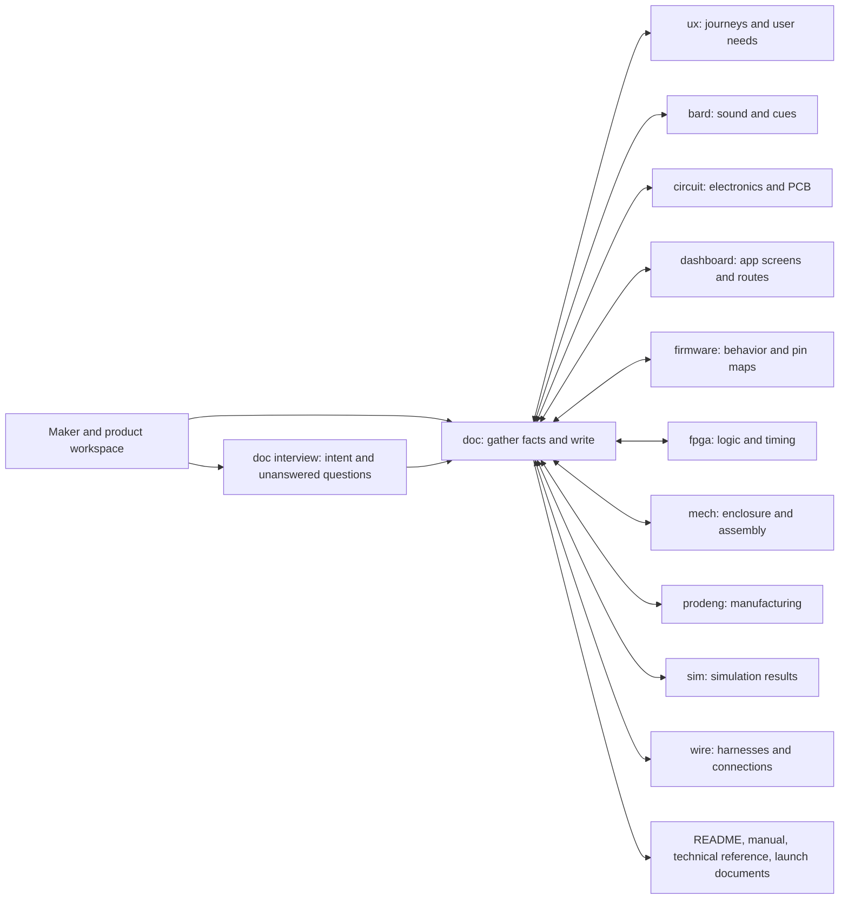
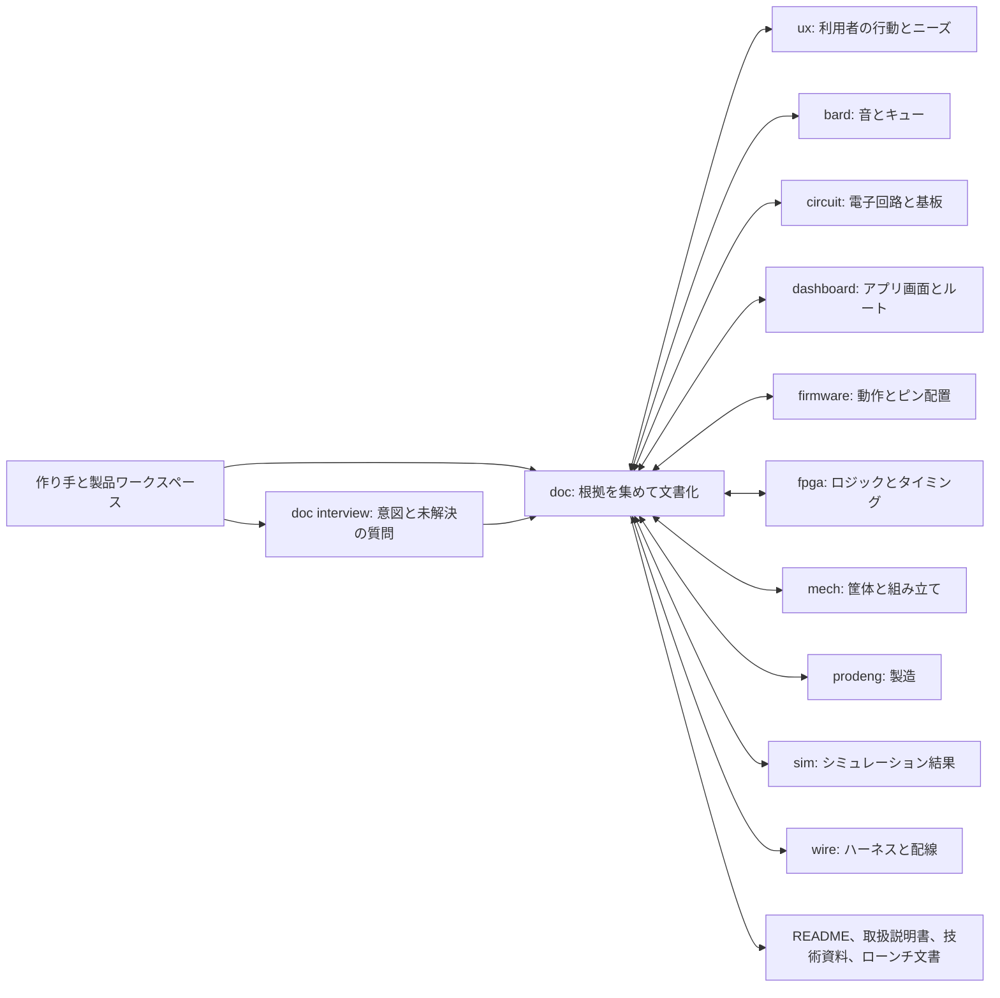

# document-agent

**English** | [日本語](#日本語)

## English

> OpenHands Software Agent SDK v1.53.0

### Turn your hardware project into clear product documents

VibeBB is a family of AI plugins that help makers design hardware products.
Each plugin contributes its own specialty. **doc** is the family’s
documentation specialist: it turns the evidence already in your project into
documents that a first-time reader, product user, or engineer can understand.

Give doc your product workspace, design files, current documentation, and the
facts you already know. It checks project files, asks an available sister
plugin about facts that sister owns, and asks you about intent or details no
one else can know. You receive drafts with cited facts, open questions, and a
record of important decisions—not claims invented to fill gaps.

| You provide | doc can produce |
| --- | --- |
| Product name, intended users, and what the product should do | A first-time-reader README with a diagram and quick start |
| Existing source, design files, reports, and project notes | A user manual and an engineer-facing technical reference |
| Answers about intent, audience, constraints, and safety | A product page, press release, demo script, and launch plan |
| Sister-plugin artifacts and answers, when available | Source-linked facts, identified conflicts, and questions still needing an answer |

`doc` documents evidence; it does not design, test, certify, or approve the
hardware itself.

### How the VibeBB plugins cooperate

The workspace is the shared hand-off point. doc reads artifacts owned by the
other plugins and can ask their agents for missing facts. The product maker
remains the authority on intent, audience, and other personal choices.

The ten sister plugins are **bard**, **circuit**, **dashboard**, **firmware**,
**fpga**, **mech**, **prodeng**, **sim**, **ux**, and **wire**. A sister must
be installed in the same OpenHands workspace for doc to delegate a question to
its agent; otherwise doc can use files already in the workspace and will
identify facts it could not confirm. The technical guide describes the
hash-bound liaison protocol and its current compatibility limits.

### Quick start

1. Install **doc** in OpenHands AgentCanvas from
   `github:VibeBB/document-agent`, using the `plugins/doc` path. Enable the
   `task_tool_set` profile tool if you want doc to delegate fact-gathering,
   writing, and review to sub-agents; doc also has a fallback when it is not
   available.
2. Open a workspace containing your product files and start a new
   conversation. Run `/doc:doctor` to check the plugin and sister availability.
3. Run `/doc:write` to prepare a README, user manual, and technical reference,
   or `/doc:launch` for fact-grounded launch materials.
4. Answer questions in your own words (or skip them), then review the
   generated documents and any open questions with your team.

Use `/doc:interview [slug] [topic]` when you want to record product intent
directly. `/doc:doctor` reports plugin setup and inbound sister requests.

| Command | What it does |
| --- | --- |
| `/doc:write [all\|readme\|manual\|tech] [subject]` | Gather evidence, ask questions, write product documents, lint, and review |
| `/doc:launch [all\|page\|press\|demo\|plan] [subject]` | Prepare a product page, press release, demo script, or launch plan from sourced facts |
| `/doc:interview [slug] [topic]` | Ask up to five questions and save your answers verbatim |
| `/doc:doctor` | Check the installation, available sister plugins, and doc liaison inbox |

### Safety and limits

- Product claims must cite a source in the documentation brief. Unknowns and
  conflicting evidence are surfaced instead of silently resolved.
- A generated manual or technical reference is not an engineering review,
  safety assessment, regulatory certification, or test result. Have qualified
  people verify safety-critical instructions and hardware decisions.
- Figures and vision reviews are evidence for readers; they are advisory and
  never turn into a pass/fail hardware verdict.
- Quality plans, test reports, risk assessments, and inspection records are
  reserved for a future contract version.
- `/doc:launch` only uses prices, dates, availability, superlatives, and other
  claims that are present in sourced facts.

### Availability

The plugin version is **0.1.0**. There is no doc tools image: its plugin
scripts and MCP server run with host `python3` and the Python standard
library. The OpenHands host must provide the SDK runtime and a working
workspace. Vision availability depends on the configured model profile.

Technical details, contracts, operational limits, and development commands
are in the [documentation index](docs/README.md). The plugin is licensed
under [BSD-3-Clause](LICENSE); third-party notices are in
[THIRD_PARTY_NOTICES.md](THIRD_PARTY_NOTICES.md).

## 日本語

### ハードウェア製品のプロジェクトから、伝わるドキュメントを作る

VibeBB は、作り手が AI と一緒にハードウェア製品を設計するための
プラグイン群です。それぞれのプラグインが専門領域を担当します。
**doc** は VibeBB のドキュメント担当で、プロジェクトにある根拠をもとに、
初めて読む人、製品を使う人、エンジニアに伝わる文書を作ります。

製品のワークスペース、設計ファイル、既存の文書、分かっている事実を
doc に渡してください。doc はプロジェクトのファイルを確認し、姉妹
プラグインが所有する事実については利用可能なエージェントに質問します。
作り手の意図など、ほかの誰にも分からないことはあなたに確認します。
出典付きの事実、未解決の質問、重要な設計判断の記録を含む文書が得られます。
不足した情報を埋めるために、事実を作り出すことはありません。

| あなたが渡すもの | doc が作成できるもの |
| --- | --- |
| 製品名、想定ユーザー、製品にさせたいこと | 図解とクイックスタートを含む README |
| ソース、設計ファイル、レポート、プロジェクトのメモ | 取扱説明書、エンジニア向け技術資料 |
| 意図、対象読者、制約、安全性に関する回答 | 製品ページ、プレスリリース、デモ台本、ローンチ計画 |
| 利用可能な姉妹プラグインの成果物や回答 | 出典付きの事実、矛盾の指摘、確認が必要な質問 |

`doc` は根拠を整理して文書にします。ハードウェアの設計、試験、認証、
安全性の承認を行うものではありません。

### VibeBB プラグインの連携

ワークスペースを共有の受け渡し場所として使います。doc は各プラグインが
担当する成果物を読み、足りない情報を担当エージェントに質問できます。
製品の意図や対象読者など、作り手自身の判断は作り手が決めます。

姉妹プラグインは **bard**、**circuit**、**dashboard**、**firmware**、
**fpga**、**mech**、**prodeng**、**sim**、**ux**、**wire** の10個です。
エージェントへの質問には、対象プラグインが同じ OpenHands ワークスペースに
インストールされている必要があります。インストールされていない場合も、
ワークスペース内のファイルは参照し、確認できなかった事実を明示します。
ハッシュ付きの連携プロトコルと現在の互換性については技術ガイドを参照してください。

### クイックスタート

1. OpenHands AgentCanvas で `github:VibeBB/document-agent` を指定して
   **doc** をインストールし、パスに `plugins/doc` を指定します。
   エージェントに事実収集・執筆・レビューを委任する場合は、プロファイルの
   ツールに `task_tool_set` を追加してください。利用できない場合の動作もあります。
2. 製品ファイルがあるワークスペースを開き、新しい会話を始めます。
   `/doc:doctor` でプラグインと姉妹プラグインの状態を確認します。
3. README、取扱説明書、技術資料を作るには `/doc:write`、
   出典付きのローンチ資料を作るには `/doc:launch` を実行します。
4. 質問には自分の言葉で答えるか、スキップします。生成された文書と
   未解決の質問をチームで確認してください。

製品に込めた意図を記録するには `/doc:interview [slug] [話題]` を使います。
`/doc:doctor` はインストール状態と doc 宛ての姉妹リクエストも報告します。

| コマンド | 内容 |
| --- | --- |
| `/doc:write [all\|readme\|manual\|tech] [題材]` | 根拠を集め、質問し、製品文書を作成・lint・レビューします |
| `/doc:launch [all\|page\|press\|demo\|plan] [題材]` | 出典付きの事実からローンチ資料を作成します |
| `/doc:interview [slug] [話題]` | 最大5問を質問し、回答をそのまま保存します |
| `/doc:doctor` | 導入状態、利用可能な姉妹プラグイン、doc の受信箱を確認します |

### 安全性と制限

- 製品についての主張は、文書ブリーフ内の出典に結び付けます。不明点や
  根拠同士の矛盾は、勝手に解決せず明示します。
- 生成された取扱説明書や技術資料は、エンジニアリングレビュー、安全性評価、
  規制認証、試験結果の代わりにはなりません。安全に関わる手順や設計は、
  有資格者に確認してください。
- 図や画像のレビューは読者のための助言記録であり、ハードウェアの合否判定では
  ありません。
- 品質計画書、試験成績書、リスクアセスメント、検査記録は将来の契約拡張用に
  予約されています。
- `/doc:launch` は、価格、日付、提供状況、最上級表現などを、出典付きの事実が
  ある場合に限って使用します。

### 利用状況

プラグインのバージョンは **0.1.0** です。doc 用のツールイメージはありません。
プラグインのスクリプトと MCP サーバーは、ホストの `python3` と Python 標準
ライブラリで動きます。OpenHands ホストには SDK ランタイムと利用可能な
ワークスペースが必要です。画像認識の利用可否は、設定されたモデルプロファイルに
よります。

技術情報、データ契約、運用上の制限、開発手順は
[ドキュメント索引](docs/README.md)を参照してください。ライセンスは
[BSD-3-Clause](LICENSE)、サードパーティの通知は
[THIRD_PARTY_NOTICES.md](THIRD_PARTY_NOTICES.md)にあります。
