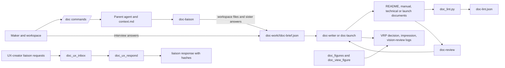

# Architecture

`doc` is an OpenHands plugin that turns workspace evidence into product and
launch documents. The plugin gathers facts, validates them in a brief,
generates Markdown, and stores the record of decisions and image reviews
separately from the lint verdict.

## Components and data flow

## Runtime boundaries

- The installable plugin is `plugins/doc`. Its manifest, agents, commands,
  skills, MCP configuration, hooks, and Python scripts are kept together.
- The SDK runs the slash commands and agent definitions. `task_tool_set`
  enables delegated stages when available; prompts contain a parent-written
  context file because task sub-agents do not receive the parent conversation.
- The deterministic linter and the record, figure, and liaison tools are
  Python standard-library programs. The stdio MCP server is implemented in
  `plugins/doc/scripts/doc_mcp.py`; it does not require the MCP or Pydantic
  Python packages.
- There is no doc tools image. Hook and MCP launchers call host `python3`.
  The SDK and model profiles are provided by the OpenHands host, not this
  repository.
- Sister code is not imported. Cooperation uses workspace artifacts, SDK
  agent delegation, and the flat `liaison/` JSON exchange.

## Workspace data

| Path | Purpose | Writer |
| --- | --- | --- |
| `doc-work/<slug>/context.md` | Conversation scope and facts needed by task agents | Parent agent |
| `doc-work/<slug>/survey.md`, `inquiries.md`, `interview.md` | Gathered evidence, unresolved questions, and verbatim user answers | Liaison and interview workflow |
| `doc-work/<slug>/doc-brief.json` | Fact ledger and target list | Writer |
| `doc-work/<slug>/doc-lint.json` | Deterministic report over a brief and its target files | `doc_lint.py` only |
| `liaison/<id>.ux-request.json` | Request addressed to a sister | UX-creator producer |
| `liaison/<id>.ux-response.json` | Validated answer to a request targeting doc | `doc_ux_respond` |
| `observations/doc/*.jsonl` | Append-only VRP records and image/vision observations | Record and hook scripts |

The brief is the source ledger for product claims. A generated document is
not itself evidence that a claim is true. The report binds the lint result to
the brief and target-document hashes; a later edit makes that report stale.
VRP logs record how the work was produced but are advisory and never change
the linter verdict.

## Trust and safety boundaries

- Product facts are sourced. The maker supplies intent through an interview;
  sister-owned technical facts are cited to that sister’s artifact or record.
- The linter verifies structure, source freshness, fact grounding, and
  document-specific rules. It is not an engineering or safety gate.
- `doc-review` returns findings and does not rewrite target documents.
- Image reviews are bound to an image hash or a recorded vision event. They
  describe observations and concerns but do not issue hardware pass/fail
  judgments.
- Hook-managed reports and evidence logs are protected from direct edits.
  The Stop hook requires fresh records for changed documentation work and
  records its last verdict.

See [contracts](contracts.md), [workflow](workflow.md), and
[records and vision](records-and-vision.md) for the details of those
boundaries.
