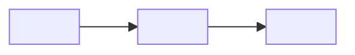

# Doc craft

Three documents, three readers. Write each for its reader, and let each link to the next
instead of repeating it.

| Document | Reader | Their question | Promise |
| --- | --- | --- | --- |
| README | a first-time visitor, not an expert | "What is this, is it for me, how do I start?" | answers all three in thirty seconds |
| User manual | someone using the product | "How do I do X? Why is it doing Y?" | every task and every visible problem |
| Technical reference | an engineer building, integrating, or maintaining it | "How is it built, what are the interfaces, how do I change it?" | precise enough to act on |

## Plain-language rules (all documents)

- Lead with what the reader gets, not how it is built. "Set a timer in one twist" before "a
  rotary encoder".
- One idea per sentence; sentences under ~25 words (Japanese: under ~60 characters).
- Name things the way the product and its UI do; explain a technical term the first time it
  appears in the README and the manual, or leave it to the technical reference.
- Use the second person and the imperative for steps ("Press the knob"). Japanese: です・ます調,
  one style per document.
- Numbers always with units; the same unit throughout.
- Headings say what the section answers ("Set a timer", not "Timer settings").
- Accessibility: every image has alt text that says what it shows; a diagram never carries
  information the text does not also give; no meaning by color alone; tables have header rows.
- Never write a claim that is not a fact in the brief. Unknown means silent plus an
  `open_questions` entry — not "coming soon", not a guess.
- The maker's intent appears only as the user said it (`product.vision`); keep it to one or
  two sentences, in their words.

## README template

~~~markdown
# <Product name>

<tagline — one sentence, what the reader gets>

## What is <Product>?            (or: <Product> とは)

<2..4 sentences in plain words: what it does and for whom.>

**Who it is for:** <audience>. **What it solves:** <problem>.

<optional: one or two sentences of the maker's intent, from product.vision>

## Quick start                    (or: クイックスタート)

1. <what you need / how to get it>
2. <first action>
3. <how you know it worked>

## Learn more
- [User manual](docs/user-manual.md): <one line>
- [Technical reference](docs/technical-reference.md): <one line>
~~~

- **The first screen decides.** Title, tagline, the explanation, and the diagram must fit
  before the reader scrolls on a laptop.
- **The diagram explains use, not internals.** A 3..6 node `flowchart LR` of what the reader
  does and gets is right for most products; a `sequenceDiagram` fits request/response
  products. Node labels are the reader's words. Keep architecture for the technical
  reference.
- **Quick start is the shortest path to the first success**: 2..7 numbered steps, each one
  action, the last one says what success looks like. Copyable commands go in fenced code
  blocks. Options, variants, and troubleshooting belong in the manual.
- Badges, license, and contribution notes go at the end, if at all.

## User manual template

1. `# <Product> user manual` (取扱説明書)
2. **What you need** / 同梱物・必要なもの
3. **Setup** / 準備 — numbered steps
4. **How to use** / 使い方 — one H3 per task, each with numbered steps and the expected
   result; a table for controls or modes
5. **Care and safety** / 安全上の注意・お手入れ — only from facts; never invent warnings,
   never drop ones the facts give
6. **Troubleshooting** / トラブルシューティング — table: what you see → what to try; every
   row a symptom the user can actually observe
7. **Specifications** / 仕様 — from facts only, with units

## Technical reference template

1. `# <Product> technical reference` (技術資料)
2. **Architecture** / アーキテクチャ — a Mermaid diagram (`flowchart`, `sequenceDiagram`,
   `stateDiagram-v2`, `erDiagram`) of the real components and their connections, then one
   paragraph per component
3. **Interfaces** / インターフェース・仕様 — tables: name, type, range/format, unit, source;
   APIs and CLIs with exact signatures and examples
4. **Data and configuration** / データ・設定 — file formats, keys, defaults
5. **Development** / 開発 — build, test, release commands exactly as the workspace runs them
6. **Sources** / 出典 — which subsystem each sibling agent owns and where its artifacts live

## Mermaid rules

- Start with the diagram type (`flowchart LR`, `sequenceDiagram`, …); one diagram per block.
- Quote labels that contain punctuation: `A["Press (1 s)"]`. Japanese labels are fine.
- 3..12 nodes. Split a larger picture into two diagrams.
- Every node traces to a fact; the text around the diagram says the same thing in words.

## Review checklist

- [ ] A first-time reader can say what it is, who it is for, and the first step after the
      README's first screen.
- [ ] The diagram explains use (README) or structure (technical reference) and matches the text.
- [ ] Every quick-start step is one action; the last says what success looks like.
- [ ] Every product claim matches a brief fact; no guessed specs, no invented intent.
- [ ] Terms are consistent across all three documents; jargon is explained or moved.
- [ ] Troubleshooting rows are observable symptoms with concrete actions.
- [ ] Alt text, table headers, no color-only meaning.
- [ ] Open questions are listed for the user, not papered over.

## Records

Follow `doc-records/SKILL.md`: leave a hash-bound stage impression after each stage and record
consequential documentation decisions. Inspect embedded figures and record a long-form vision
review when the image is available; vision never changes the lint verdict.
