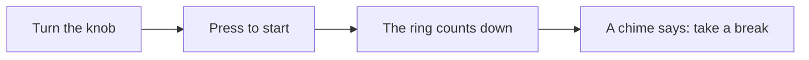

# Tomo Timer

A one-knob desk timer that tells you when to take a break.

**Set a timer in one twist.** No app, no account, no notifications.

## Why Tomo Timer

- **Nothing to look at.** Turn the knob to choose from 1 to 90 minutes and press it.
- **You see time pass.** A 12-LED ring shows how much time is left.
- **It tells you once.** When time is up it chimes and glows amber until you press the knob.
- **Any charger works.** It runs from USB-C at 5 V.

## Specifications

| Item | Value |
| --- | --- |
| Timer range | 1 to 90 minutes, 1-minute steps |
| Display | 12-LED ring |
| Power | USB-C, 5 V, under 0.5 W |
| Size | 62 mm across, 28 mm tall |

## Pre-order

Pre-order Tomo Timer from the online shop from 2026-11-02 for 4,980 yen including tax.
