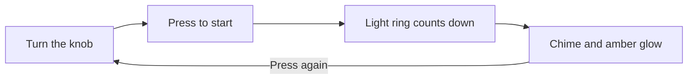

# Tomo Timer

A one-knob desk timer that tells you when to take a break.

## What is Tomo Timer?

Tomo Timer is a palm-sized desk timer. Turn the knob to set minutes, press it
to start, and a soft light ring counts down. No app, no account, no
notifications.

**Who it is for:** anyone who works at a desk and forgets to take breaks.

## Quick start

1. Plug Tomo Timer into any USB-C charger.
2. Turn the knob until the ring shows the minutes you want.
3. Press the knob. The ring starts counting down.
4. When it chimes, press the knob to stop the glow.

## Learn more

- [User manual](docs/user-manual.md): every feature, care, and troubleshooting.
- [Technical reference](docs/technical-reference.md): hardware, firmware, and
  how to build it yourself.
