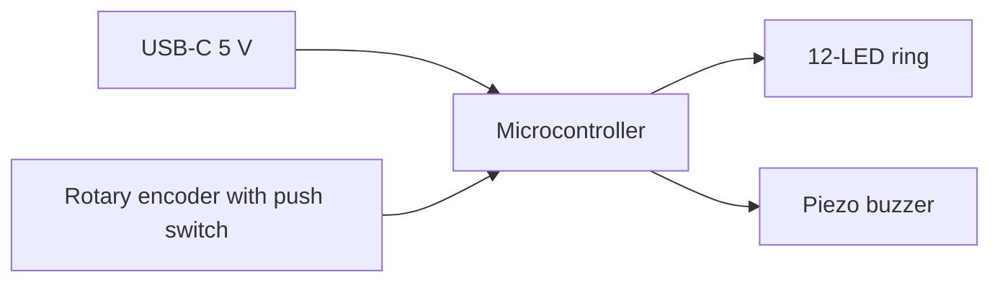

# Tomo Timer technical reference

## Architecture

The firmware is a single state machine: `idle -> setting -> running -> done`.

## Interfaces

| Interface | Detail |
| --- | --- |
| Power | USB-C 5 V, under 0.5 W |
| Input | Rotary encoder, 1 minute per detent, 1 to 90 minutes |
| Output | 12-LED ring, piezo buzzer |

## Development

Build and flash the firmware from `firmware/` with the toolchain described in
its own README. The enclosure and circuit sources come from the mech and
circuit sister agents.

## Rationale

The circuit decision record `observations/circuit/decisions.jsonl` selects a
light ring over a numeric display so the remaining-time state stays visible
without a separate screen or phone.
